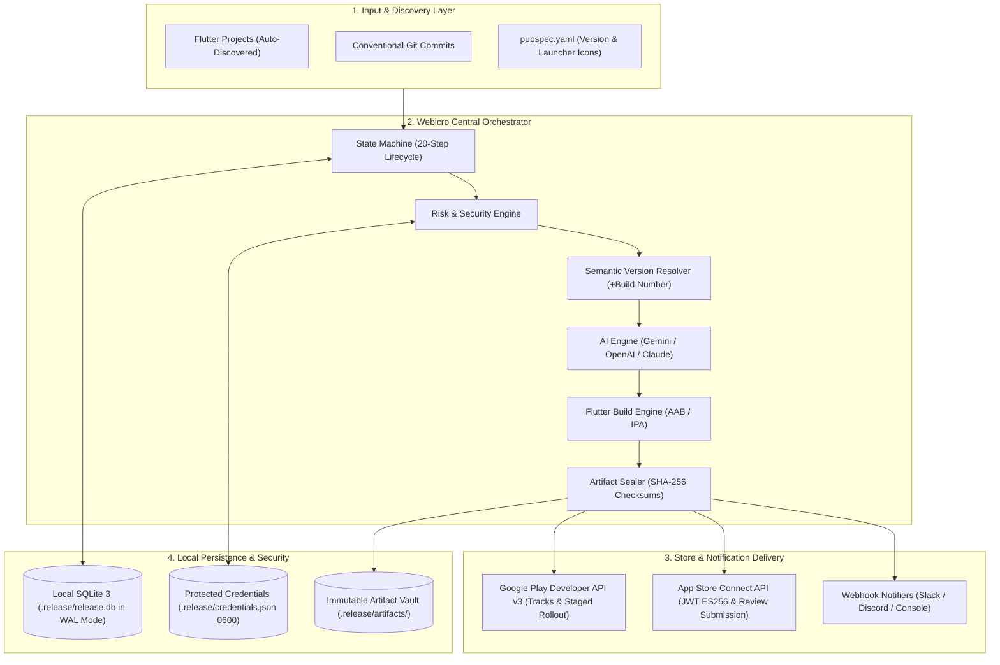
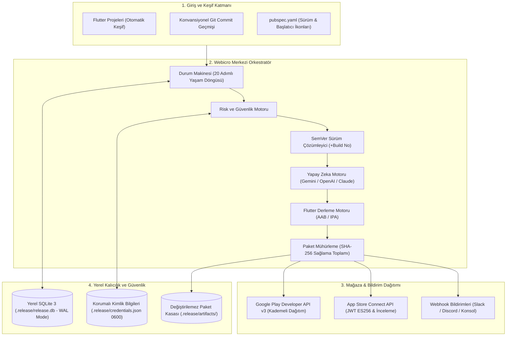

<p align="center">
  <picture>
    <source media="(prefers-color-scheme: dark)" srcset="assets/logo.png">
    <source media="(prefers-color-scheme: light)" srcset="assets/logo-dark.png">
    
  </picture>
</p>
<p align="center">
  <strong>AI-Powered Local-First Flutter Release Orchestrator & Multi-Store Delivery Platform</strong>
</p>
<p align="center">
  A product of <a href="https://www.webicro.com"><strong>Webicro</strong></a> ❤️ Bir <a href="https://www.webicro.com"><strong>Webicro</strong></a> ürünüdür
</p>
  <p align="center">
    <a href="#-webicro-distribution--local-first-flutter-release-orchestrator">English</a>
    &nbsp;•&nbsp;
    <a href="#-webicro-distribution--yerel-öncelikli-flutter-dağıtım-orkestratörü">Türkçe</a>
  </p>
  <p align="center">
    <a href="https://github.com/ramiartas0/Webicro-Distribution/actions/workflows/ci.yml"></a>
    <a href="https://www.typescriptlang.org/"></a>
    <a href="https://opensource.org/licenses/MIT"></a>
    <a href="https://nodejs.org/"></a>
    <a href="https://flutter.dev/"></a>
  </p>
</p>

---

# Webicro Distribution — Local-First Flutter Release Orchestrator

**Webicro Distribution** is an open-source, enterprise-grade, **local-first** release orchestrator for mobile Flutter applications. It unifies project discovery, semantic versioning (SemVer), static analysis, automated testing, native compilation (Android AAB & iOS IPA), cryptographic artifact sealing, AI-powered multilingual release note generation (Gemini, OpenAI, Claude), and direct zero-friction distribution to **Google Play Console** and **Apple App Store Connect** into a single, cohesive engine.

Featuring both an interactive **Monochrome Web Dashboard** and a resilient **Terminal CLI**, Webicro executes a strict 20-step release lifecycle with fail-closed safety gates, guaranteed zero token leakage, and local SQLite audit persistence.

---

## System Architecture & Orchestration Flow

The platform is designed around an event-driven, fail-closed state machine. Each step produces verifiable cryptographic artifacts and audit log entries before advancing:



---

## Technology Stack

### Core Engine & Orchestration
* **Runtime:** Node.js 20+ (ES Modules)
* **Language:** TypeScript 5.8+ strictly enforced (`noImplicitAny`, zero `@ts-ignore`)
* **State Machine & Execution:** Custom 20-step lifecycle runner with `AbortController` and atomic rollback
* **Database & Auditing:** SQLite 3 via `better-sqlite3` configured with Write-Ahead Logging (`WAL` mode)
* **Configuration:** YAML loader with comprehensive `Zod` schema validation and snake_case normalization

### User Interfaces (Web & CLI)
* **Web Dashboard:** React 18, Vite, Tailwind CSS, Radix Primitives, Lucide Icons
* **Live Telemetry:** Server-Sent Events (SSE) streaming real-time stage progress, store comparison, and audit logs
* **CLI Experience:** Commander.js, `@clack/prompts`, Ora spinner, Chalk formatting

### Artificial Intelligence & Release Notes
* **Google Gemini API:** Native SDK (`gemini-2.5-flash`, `gemini-1.5-pro`)
* **OpenAI API:** Official SDK (`gpt-4o-mini`, `gpt-4o`)
* **Anthropic API:** Claude 3.5 Sonnet integrations
* **Offline Conventional Fallback:** Instant zero-API release notes generated purely from commit semantics
* **Validation:** Automated guardrails preventing fabricated claims, sensitive secrets, or character limit violations

### Store Delivery & Signing
* **Google Play Console:** Official `@googleapis/androidpublisher` v3 supporting internal, alpha, beta, and staged rollouts
* **Apple App Store Connect:** Custom ES256 JWT generator and direct chunked binary uploader
* **Artifact Security:** Streaming SHA-256 digest calculation and immutable `checksums.txt` generation

---

## Monorepo Layout

```text
webicro-distribution/
├── apps/
│   ├── cli/                   # Terminal interface (commands: release, ui, status, rollback, resume)
│   └── web/                   # Responsive, monochrome local web dashboard (Vite + React)
├── packages/
│   ├── core/                  # 20-step central orchestrator, state machine & rollback strategy
│   ├── config/                # YAML configuration parser & Zod validation schemas
│   ├── git/                   # Git log analysis, conventional commit parser & native diff detection
│   ├── versioning/            # SemVer 2.0 resolver, auto build increment & store conflict checker
│   ├── changelog/             # Automated CHANGELOG.md generator and markdown prepender
│   ├── validation/            # Store text limits, sensitive data regex scanner & forbidden terms filter
│   ├── ai/                    # Multi-provider AI release notes engine with safety grounding
│   ├── flutter/               # Flutter doctor, static analyze, automated test runner & pubspec sync
│   ├── android/               # Flutter Android AAB build engine
│   ├── ios/                   # Flutter iOS IPA build engine (macOS verified)
│   ├── artifacts/             # Streaming SHA-256 hasher, vault storage & checksum verification
│   ├── security/              # SecretScanner (detects exposed keys) and release risk engine
│   ├── google-play/           # Google Play Developer API v3 client adapter
│   ├── app-store/             # App Store Connect ES256 JWT adapter & live store sync
│   ├── notifications/         # Multi-channel webhooks (Slack, Discord, Console)
│   ├── database/              # SQLite 3 schema, migrations, WAL mode & repository pattern
│   └── shared/                # Structured logger, error hierarchy & exponential backoff retry
├── Formula/
│   └── webicro.rb             # Homebrew package formula
├── scripts/
│   ├── install.sh             # Universal one-line installer for macOS and Linux
│   └── install.bat            # One-click Windows installer
├── .github/workflows/
│   ├── ci.yml                 # Monorepo typecheck, lint & test automated quality gate
│   └── release.yml            # Multi-channel release workflow (NPM, Homebrew, GitHub Releases)
└── README.md
```

---

## Installation & Quick Start

### 1. Universal One-Line Installer (macOS & Linux)

Install the latest version with a single command:

```bash
curl -fsSL https://raw.githubusercontent.com/ramiartas0/webicro-distribution/main/scripts/install.sh | bash
```

### 2. macOS Homebrew Installation

```bash
brew install webicro
# Or build from local formula:
brew install --build-from-source Formula/webicro.rb
```

### 3. Package Manager (Global NPM / PNPM)

```bash
npm install -g @webicro/cli
# or
pnpm add -g @webicro/cli
```

### 4. Running from Source (Local Monorepo)

```bash
git clone https://github.com/ramiartas0/Webicro-Distribution.git
cd Webicro-Distribution
pnpm install
pnpm build
```

---

## Service Map & Security Architecture

| Endpoint / Service | Access URI | Description |
| :--- | :--- | :--- |
| **Web Dashboard (GUI)** | `http://127.0.0.1:3100/?token=...` | Live monochrome interface with cryptographic session token |
| **REST API & SSE** | `http://127.0.0.1:3100/api/*` | Localhost loopback API for project sync and stage streaming |
| **Release Database** | `.release/release.db` | Synchronous SQLite database storing runs, artifacts, and audit logs |
| **Protected Credentials** | `.release/credentials.json` | Local store credentials stored with `0600` permissions |

### Security Guardrails
1. **Loopback Isolation:** The web server strictly binds to `127.0.0.1` and forbids external incoming connections (`0.0.0.0`).
2. **Cryptographic Session Token:** Every dashboard start generates a 24-byte cryptographically secure session token. Requests lacking the token or invalid origins are rejected with `401 Unauthorized`.
3. **No Automatic Secret Scraping:** System never silently reads sensitive directories (`~/.secrets/...`). Keys are only utilized when explicitly supplied in `.env` or saved in the local credentials manager.
4. **Path Traversal Protection:** All project paths are validated against `isSafeProjectPath` to prevent unauthorized file access.

---

## Command Matrix & CLI Usage

```bash
# Launch interactive web dashboard
webicro ui

# Start full automated release workflow
webicro release

# Perform safe simulation without uploading to stores
webicro release --dry-run

# Run Flutter doctor, static analyze and tests only
webicro release --validate-only

# Compile AAB and IPA binaries locally without store deployment
webicro release --build-only

# Check status of the latest release run
webicro status

# Resume an interrupted release by ID
webicro resume REL-2026-10-04-A1B2C3

# Rollback an aborted release
webicro rollback REL-2026-10-04-A1B2C3

# Inspect SQLite audit logs
webicro logs
```

---

## Contributing

We welcome community contributions! Please read our [Contributing Guide](CONTRIBUTING.md) for details on our enterprise Git branching model (`main`, `develop`, `feat/*`, `fix/*`), commit conventions, and pull request workflow. All participants must abide by our [Code of Conduct](CODE_OF_CONDUCT.md).

---

## License

This project is licensed under the [MIT License](LICENSE).

---

<p align="center">
  A product of <a href="https://www.webicro.com"><strong>Webicro</strong></a> • Made with ❤️ by <a href="https://www.webicro.com">Webicro</a>
</p>


---
---

# Webicro Distribution — Yerel Öncelikli Flutter Dağıtım Orkestratörü

**Webicro Distribution**, Flutter mobil uygulamaları için geliştirilmiş kurumsal seviyede, açık kaynak kodlu ve **yerel öncelikli (local-first)** bir sürüm dağıtım orkestratörüdür. Proje keşfi, semantik sürümleme (SemVer), statik analiz, otomatik test, yerel paket derleme (Android AAB & iOS IPA), kriptografik sağlama toplamı mühürleme, yapay zeka destekli çok dilli sürüm notu üretimi (Gemini, OpenAI, Claude) ve **Google Play Console** ile **Apple App Store Connect** mağazalarına sıfır riskle doğrudan aktarım süreçlerini tek bir merkezden yönetir.

Hem minimalist bir **Monokrom Web Dashboard** hem de dayanıklı bir **Terminal CLI** arayüzü sunan Webicro; fail-closed güvenlik kapıları, sıfır token sızıntısı garantisi ve yerel SQLite denetim günlüğü ile 20 adımlı katı bir sürüm yaşam döngüsü uygular.

---

## Sistem Mimarisi ve Orkestrasyon Akışı

Platform, olay tabanlı ve fail-closed prensibiyle çalışan bir durum makinesi (state machine) üzerine inşa edilmiştir. Her adım, sonraki aşamaya geçmeden önce doğrulanabilir kriptografik çıktılar ve denetim kayıtları üretir:



---

## Teknoloji Yığını (Tech Stack)

### Çekirdek Motor ve Orkestrasyon
* **Çalışma Zamanı:** Node.js 20+ (ES Modules)
* **Programlama Dili:** TypeScript 5.8+ (Strict Mode - Asla `any` ve `@ts-ignore` barındırmaz)
* **Durum Makinesi:** Atomik geri alma (rollback) ve `AbortController` destekli 20 adımlı yaşam döngüsü
* **Veritabanı ve Denetim:** Write-Ahead Logging (`WAL`) modunda çalışan SQLite 3 (`better-sqlite3`)
* **Yapılandırma:** Zod şemalarıyla korunan ve snake_case normalizasyonu yapan YAML ayrıştırıcı

### Kullanıcı Arayüzleri (Web & CLI)
* **Web Kontrol Paneli:** React 18, Vite, Tailwind CSS, Radix UI bileşenleri, Lucide ikon seti
* **Canlı Veri Akışı:** Server-Sent Events (SSE) ile anlık aşama bildirimleri, mağaza karşılaştırmaları ve denetim günlüğü
* **Terminal Deneyimi:** Commander.js, `@clack/prompts`, Ora animasyonları ve Chalk renkleri

### Yapay Zeka ve Sürüm Notları
* **Google Gemini API:** `@google/generative-ai` (`gemini-2.5-flash`, `gemini-1.5-pro`)
* **OpenAI API:** `openai` SDK (`gpt-4o-mini`, `gpt-4o`)
* **Anthropic API:** Claude 3.5 Sonnet entegrasyonu
* **Çevrimdışı Konvansiyonel Mod:** API anahtarı olmadan commit mesajlarından anında sürüm notu üretimi
* **Güvenlik Filtreleri:** Uydurma özellikleri, gizli anahtarları ve karakter sınırı aşımlarını engelleyen denetleyiciler

### Mağaza Entegrasyonu ve Mühürleme
* **Google Play Console:** Dahili, alfa, beta ve kademeli canlı dağıtım destekli resmi `@googleapis/androidpublisher` v3
* **Apple App Store Connect:** ES256 JWT üreteci ve doğrudan parçalı ikili paket yükleme motoru
* **Paket Bütünlüğü:** Streaming SHA-256 hesaplama ve değiştirilemez `checksums.txt` mühür kaydı

---

## Proje Dizin Yapısı (Monorepo)

```text
webicro-distribution/
├── apps/
│   ├── cli/                   # Terminal arayüzü (komutlar: release, ui, status, rollback, resume)
│   └── web/                   # Hızlı, monokrom yerel web kontrol paneli (Vite + React)
├── packages/
│   ├── core/                  # 20 adımlı merkezi orkestratör, durum makinesi & geri alma stratejisi
│   ├── config/                # YAML yapılandırma ayrıştırıcı & Zod doğrulama şemaları
│   ├── git/                   # Git log analizi, konvansiyonel commit ayrıştırıcı & native fark sezimi
│   ├── versioning/            # SemVer 2.0 çözümleyici, otomatik build artırıcı & mağaza çakışma denetimi
│   ├── changelog/             # Otomatik CHANGELOG.md üreteci ve markdown formatlayıcı
│   ├── validation/            # Mağaza karakter sınırları, hassas veri tarayıcı & yasaklı terim filtresi
│   ├── ai/                    # Güvenlik tabanlı çoklu sağlayıcılı yapay zeka sürüm notu motoru
│   ├── flutter/               # Flutter doctor, statik analiz, otomatik test koşucu & pubspec eşitleyici
│   ├── android/               # Flutter Android AAB paket derleme motoru
│   ├── ios/                   # Flutter iOS IPA paket derleme motoru (macOS korumalı)
│   ├── artifacts/             # Streaming SHA-256 özetleyici, kasa depolama & sağlama toplamı doğrulama
│   ├── security/              # SecretScanner (açıkta kalan anahtar tespiti) ve sürüm risk motoru
│   ├── google-play/           # Google Play Developer API v3 istemci adaptörü
│   ├── app-store/             # App Store Connect ES256 JWT adaptörü & canlı mağaza senkronizasyonu
│   ├── notifications/         # Çok kanallı webhook bildirimleri (Slack, Discord, Konsol)
│   ├── database/              # SQLite 3 şeması, migrasyonlar, WAL modu & repository deseni
│   └── shared/                # Yapısal logger, hata hiyerarşisi & üstel geri çekilmeli retry mekanizması
├── Formula/
│   └── webicro.rb             # Homebrew paket formülü
├── scripts/
│   ├── install.sh             # macOS ve Linux için tek satırlık evrensel kurulum betiği
│   └── install.bat            # Windows için tek tıkla kurulum betiği
├── .github/workflows/
│   ├── ci.yml                 # Monorepo tip denetimi, lint & test otomatik kalite kapısı
│   └── release.yml            # Çok kanallı dağıtım iş akışı (NPM, Homebrew, GitHub Releases)
└── README.md
```

---

## Kurulum ve Hızlı Başlangıç

### 1. Evrensel Tek Satırda Kurulum (macOS & Linux)

Tek bir komutla en son kararlı sürümü kurun:

```bash
curl -fsSL https://raw.githubusercontent.com/ramiartas0/webicro-distribution/main/scripts/install.sh | bash
```

### 2. macOS Homebrew ile Kurulum

```bash
brew install webicro
# Veya yerel formül üzerinden:
brew install --build-from-source Formula/webicro.rb
```

### 3. Paket Yöneticisi ile Kurulum (Global NPM / PNPM)

```bash
npm install -g @webicro/cli
# veya
pnpm add -g @webicro/cli
```

### 4. Kaynak Koddan Çalıştırma (Geliştirici Ortamı)

```bash
git clone https://github.com/ramiartas0/Webicro-Distribution.git
cd Webicro-Distribution
pnpm install
pnpm build
```

---

## Port Haritası ve Güvenlik Modeli

| Servis / Uç Nokta | Adres | Açıklama |
| :--- | :--- | :--- |
| **Web Dashboard (GUI)** | `http://127.0.0.1:3100/?token=...` | Kriptografik oturum tokenı ile korunan canlı kontrol paneli |
| **REST API & SSE** | `http://127.0.0.1:3100/api/*` | Yerel loopback üzerinden proje ve aşama veri akışı |
| **Sürüm Veritabanı** | `.release/release.db` | Dağıtım geçmişi ve denetim loglarını tutan SQLite veritabanı |
| **Korumalı Anahtarlar** | `.release/credentials.json` | İşletim sisteminde `0600` yetkileriyle korunan kimlik bilgileri |

### Güvenlik Standartları
1. **Yerel Ağ İzolasyonu:** Sunucu asla dış ağlara (`0.0.0.0`) açılmaz; yalnızca `127.0.0.1` yerel loopback üzerinde çalışır.
2. **Kriptografik Oturum Tokenı:** Panel başlatıldığında 24 baytlık rastgele bir token üretilir. Token taşımayan istekler `401 Unauthorized` ile engellenir.
3. **İzinsiz Anahtar Taramama Garantisi:** Sistem asla `~/.secrets/...` gibi gizli dizinleri arka planda sessizce tarayıp aktif etmez.
4. **Dizin Aşımı Koruması:** Tüm dosya yolları `isSafeProjectPath` süzgecinden geçirilerek sistem dosyalarına izinsiz erişim engellenir.

---

## Komut Listesi ve Kullanım

```bash
# Canlı web kontrol panelini açar
webicro ui

# Tam otomatik dağıtım sürecini başlatır
webicro release

# Mağazalara yüklemeden simülasyon modunda çalıştırır
webicro release --dry-run

# Yalnızca ortam, Flutter analizi ve testleri doğrular
webicro release --validate-only

# Mağazaya yüklemeden yerel AAB ve IPA paketlerini derler
webicro release --build-only

# Son dağıtımın durumunu gösterir
webicro status

# Yarıda kalan bir dağıtımı ID ile devam ettirir
webicro resume REL-2026-10-04-A1B2C3

# Başarısız bir dağıtımı geri alır
webicro rollback REL-2026-10-04-A1B2C3

# SQLite denetim günlüğünü terminalde listeler
webicro logs
```

---

## Katkıda Bulunma

Topluluk katkılarını memnuniyetle karşılıyoruz! Kurumsal Git dal stratejimiz (`main`, `develop`, `feat/*`, `fix/*`), commit kurallarımız ve Pull Request akışımız için [Katkı Rehberi](CONTRIBUTING.md) belgesini inceleyiniz. Tüm katılımcıların [Davranış Kuralları](CODE_OF_CONDUCT.md) ilkelerine uyması beklenir.

---

## Lisans

Bu proje [MIT Lisansı](LICENSE) kapsamında açık kaynak olarak dağıtılmaktadır.

---

<p align="center">
  Bir <a href="https://www.webicro.com"><strong>Webicro</strong></a> ürünüdür • <a href="https://www.webicro.com">Webicro</a> tarafından ❤️ ile geliştirilmiştir
</p>


